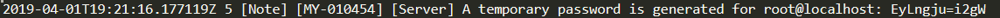
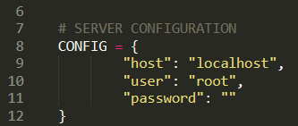

# Project 5: Use public data from OpenFoodFacts

In order to propose **healthy** food to their customers.
Pur Beurre, a new food startup, need a software that use the api of OpenFoodFacts
to compare the quality of the food.  

The goal is to search, compare and propose a most healthy food that the one in Pur beurre store !  

The software must keep track of the food swap.


## Requirements

more information [here](https://github.com/MassDo/Projet_5_OC/blob/master/requirement.txt) with the requirement.txt. 

To create and virtual environment use this following command in prompt:  
```python -m venv path\to\the\env_name```   
  
then to activate it  
```env_name\Scripts\activate.bat```  
  
or  
```env_name\Scripts\activate```  

from your virtual environment activated you can now download libraries with this command:  
```pip install -r requirements.txt```  

#### MySQL  
You have now all the libraries to run the app ! You need, just one last thing: launch the server. For windows machine follow this steps:

1. Install MySQL with this [link](https://dev.mysql.com/doc/mysql-installation-excerpt/8.0/en/)  
2. Launch a prompt and use this command to set the server:  
```mysqld --console```  
3. Launch another prompt windows and use this command to opend MySQL client:  
```mysql -u root -p```  
it will ask you a password, if it's your first use you can find it in your file:  
```\mysql\data\your_computer_name.err```  
it look like this  and it's done !   

## Prerequisites

you need a MySQL server operational. The configuration of you server need to be filled in the product/constantes.py module here




### Installing

If you have follow the steps, you know have a virtual environment with all the libraries, and a MySQL server/client operational.
You have set your personal configuration into the **_constantes.py_** module and you are ready to launch the App! 

Launch it with the main.py file.  

- At the first use, the App will make you wait for a short periode of time, in order to create database, tables, and download the products via the API OpenFoodFacts. **Your need to be connected to the internet for this first connection !** 

- After the first use, the database is already created with all the products inside. So you can run the App off the internet.  

## Versioning
1  

## Authors  

**Massoulier Dorian** 

## License

it's free, more info 


